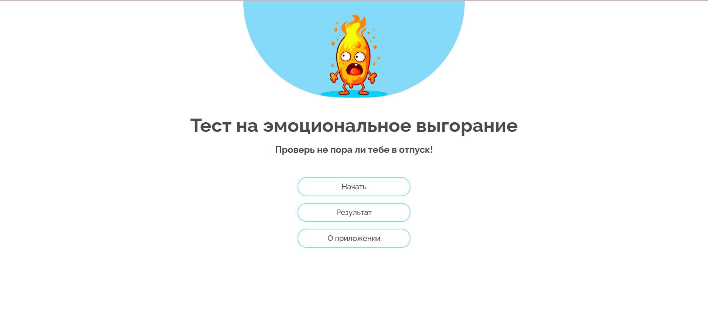
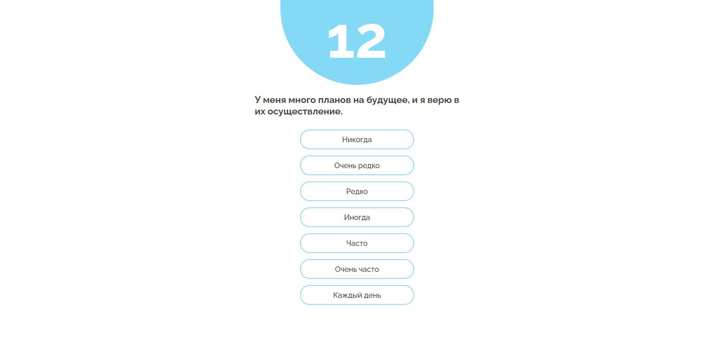
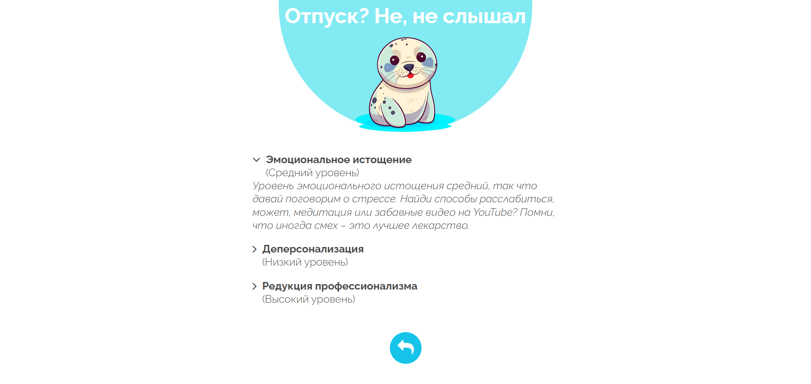
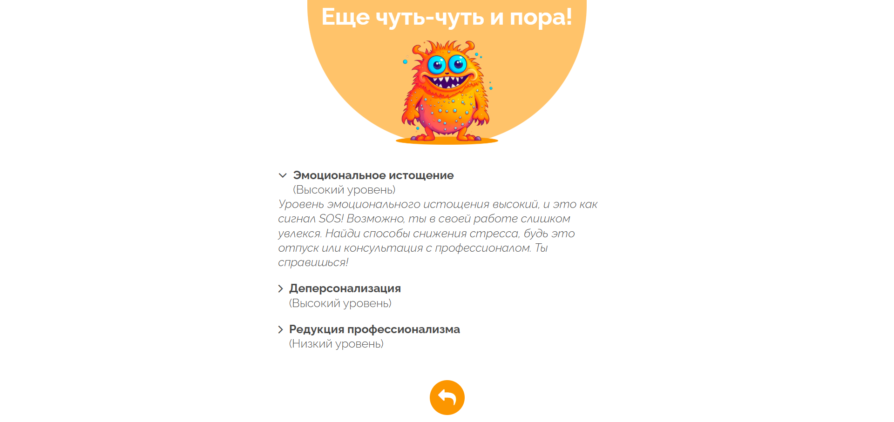

# 🧠 Psychology Test - Maslach Burnout Inventory

  

<p align="center">
  <a href="https://github.com/elfototo/App_psycology_test_Maslach" target="_blank">
    
  </a>
</p>

> **A psychological burnout test based on the Maslach Burnout Inventory (MBI). The app helps individuals evaluate their level of burnout and provides insights into managing work-related stress.**

---

## 📚 Table of Contents
- [🧠 Psychology Test - Maslach Burnout Inventory](#-psychology-test---maslach-burnout-inventory)
  - [📚 Table of Contents](#-table-of-contents)
  - [🎯 General Project Description](#-general-project-description)
  - [⚙️ Tech Stack](#️-tech-stack)
  - [🚀 Installation Guide](#-installation-guide)
    - [Prerequisites](#prerequisites)
    - [Steps to get started](#steps-to-get-started)
  - [💡 Usage](#-usage)
  - [🌐 Live Demo](#-live-demo)
  - [📸 Screenshots](#-screenshots)

---

## 🎯 General Project Description

This project is an interactive **Maslach Burnout Inventory (MBI)** test designed to assess an individual's burnout level. The test evaluates emotional exhaustion, depersonalization, and personal accomplishment. It’s an effective tool for understanding the psychological well-being of professionals and individuals in high-stress environments.

**Main features:**
- **Maslach Burnout Inventory (MBI)**: A widely used psychological tool for assessing burnout.
- **Interactive UI**: Easy-to-use interface for completing the test.
- **Results**: The test calculates scores based on user responses and provides personalized feedback.

---

## ⚙️ Tech Stack


---

## 🚀 Installation Guide

### Prerequisites
Before you begin, ensure you have the following installed:
- **Node.js** version 14.x or higher (optional, if you want to make local changes or build).

### Steps to get started

1. **Clone the repository:**

    ```bash
    git clone https://github.com/elfototo/App_psycology_test_Maslach.git
    cd App_psycology_test_Maslach
    ```

2. **Install the dependencies (optional):**

    If you want to run the project locally and make changes, you can install the dependencies:

    ```bash
    npm install
    ```

3. **Run the project locally using Go Live (VS Code extension):**

    - If you're using **VS Code**, you can use the **Go Live** extension to start the project.
    - Simply open the project folder in **VS Code**, then click the **Go Live** button in the bottom-right corner. This will launch the application in your browser.

    Alternatively, if you prefer not to use **VS Code**, you can serve the project locally using any static server, such as **http-server**.

    To install **http-server** (if you don't have it), you can run:

    ```bash
    npm install -g http-server
    ```
    
    ```bash
    http-server
    ```
---

## 💡 Usage

Once the application is running, the user can follow these steps:
1. **Start the test:** On the main page, click **"Start Test"** to begin answering the questions.
2. **Answer questions:** You will be asked a series of questions related to emotional exhaustion, depersonalization, and personal accomplishment.
3. **View results:** After completing the test, you will receive a result with personalized feedback and insights into your burnout level.

---

## 🌐 Live Demo

You can take the test directly online on [GitHub Pages](https://elfototo.github.io/App_psycology_test_Maslach/).

---

## 📸 Screenshots

Here are some screenshots from the app:

|  |  |  |  |
|:------------------------------------------------:|:------------------------------------------------:|:------------------------------------------------:|:------------------------------------------------:|
| **Screenshot 1**: Main screen                     | **Screenshot 2**: Answering questions            | **Screenshot 3**: Result                | **Screenshot 4**: Result                |


